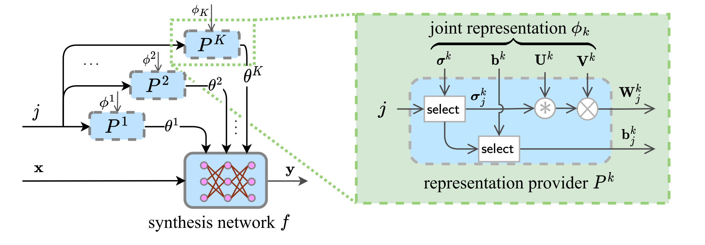

# SVD SIREN / Joint Neural Representation for Multiple Light Fields

This code describes and allows for the execution of the algorithm described in the paper "Joint Neural Representation for Multiple Light Fields" submitted to ICASSP 2023.
It it designed to learn a joint implicit neural representation of a collection of light fields.

Implicit neural representations are neural networks that represent a signal as a mapping from the space of coordinates to the space of values. For traditional images, it is a mapping from a 2D space to a 3D space. In the case of light field, it is a mapping from a 4D to a 3D space.

The algorithm works by learning a factorisation of the weights and biases of a SIREN (Sitzmann et al. [2020](https://dl.acm.org/doi/10.5555/3495724.3496350)) based network. The network itself is inspired from the SIGNET architecture (Feng & Varshney [2021](https://ieeexplore.ieee.org/document/9710101)), a variant of SIREN. However, unlike SIGNET which uses the Legendre polynomials as the positional encoding, the model used in the described here is using learned Fourier Features (Tancik et al. [2020](https://bmild.github.io/fourfeat/)).

For each layer, a base of matrices is learned that serve as a representation shared between all light fields (a.k.a. scene) of the dataset, together with, for each scene in the dataset, a set of coefficients with respect to this base, which act as individual representations. 

The matrices formed by taking the linear combinations of the base matrices with the coefficients corresponding to a given scene serve as the weight matrices of a SIREN network.
In additional to the set of coefficients, we also learn an individual bias vector for each scene.

More precisely, the code uses matrix factorization inspired from the Singluar Value Decomposition (SVD). For a layer with input size `fan_in` and output size `fan_out`, the algorithm learns a matrix `U` of size `fan_in * rank`, a matrix `V` of size `rank * fan_out`, and a matrix `Sigma` of size `number_of_scenes * rank`, where `rank` denotes the dimension of the matrix space, and be adjusted as hyper-parameter to trade representation size with distortion. Then the weight matrix for this layer corresponding to the scene `i` is given by: `U @ diag(Sigma) @ V` where `@` is matrix multiplication. In addition, for each layer and each scene, an individual bias vector is learned.

The algorithm is therefore composed of two parts:

1. The representation provider, which takes the index `i` of a scene, and outputs a weight matrix and bias vector for each layer. 

2. The synthesis network which, using the weights and biases, computes the values of the pixels by querying the network on the coordinates of all pixels.

The network is learned using Adam, a flavour of the SGD algorithm. At each iteration, a light field index `i` is chosen at random, along with a batch of coordinates, and the corresponding values are predicted, using weights and biases from the representation provider and the synthesis network. The model's parameters `U`, `V` and (the relevant column of) `Sigma` are then updated by gradient backprogagation from a MSE minimization objective.

The code uses TensorFlow 2.7

The architecture is illustrated in 

## How to use

Requirements: Python 3.7, TensorFlow 2.7

The simplest command

```python train.py```

runs the joint representation learning for the default dataset (located in datasets/Flowers). To use a different dataset, run 

```python train.py --scenes_directory [dataset_directory]```

The `datasets` folder already contains a mock version of the 'Flowers' dataset (Srinivasan et al. [2018](https://arxiv.org/abs/1708.03292)) and of the [Stanford Lytro](http://lightfields.stanford.edu/LF2016.html) dataset.

To reproduce the experiments, please download the full version of these datasets.

By default, the dataset directory is assumed to contain 14 x 14 macropixel image representations of light fields of shape (375 x 14) x (540 x 14) x (3 color channels) as PNG files. The light field is then cropped to only retain the 8 x 8 most central views. As an alternative format, it is possible to provide a dataset directory containing one directory per light field, where each light field directory contains the sub-aperture images with naming convention `lf_[u]_[v].png`. In that case, the additional `--subaperture_images` argument must be provided.

For instance:

```python train.py --scenes_directory datasets/StanfordLytro --subaperture_images```

Note that before training, each light field of the dataset is shuffled and cached.

The other parameters that can be provided are:
- `epochs`: number of training epochs
- `steps_per_epoch`: number of steps per epoch
- `batch_size`
- `hidden_dim`: dimension of a hidden layer in the synthesis network
- `depth`: depth of the synthesis network
- `rank`: rank of the joint representation
- `omega_0`: factor defined in SIREN
- `verbose`: either 0, 1 or 2
- `lr_cosine_decay_initial_value`: initial value for the learning rate
- `lr_cosine_decay_final_value`: final value for the learning rate
- `adam_epsilon`
- `scenes_directory`: directory containing the light fields
- `cache_directory`: directory where the shuffled dataset will be cached
- `checkpoint_root`: directory where the models will be saved
- `tensorboard_root`: logging directory
- `limit_number_of_scenes`: use only the first N scenes instead of the whole dataset.


